# Library-Store-System
### This is a hybrid **Library & Bookstore Management System** developed in **C++** using **Object-Oriented Programming (OOP)**.  
### It features a fully interactive **console-based UI** with multiple screens, user roles, and frequent data handling.

---

##  Demo Video

 [Watch the full video demo on YouTube](https://youtu.be/7x-1nLSwUWs?si=ik21y7c5U6LjaBVE)

---

##  Table of Contents

- [Project Description](#project-description)
  - [Overview](#overview)
  - [Objectives](#objectives)
  - [Tools and Framework](#tools-and-framework)
- [Features](#features)
  - [Guest Functionalities](#guest-functionalities)
  - [General User Functionalities](#general-user-functionalities)
  - [Admin Functionalities](#admin-functionalities)
- [Screenshots](#screenshots)
- [Author](#author)

---
## Project Description

### Overview 
The Library Store System is a console-based application developed in C++ using Object-Oriented Programming (OOP) principles.
It simulates real-world operations, and it simulates a hybrid system that combines both library operations and basic e-commerce/store management functionalities.

### Objectives
- Apply core **OOP concepts** including inheritance, encapsulation, and polymorphism.
- Design and implement a **hybrid system** that blends both library and e-commerce functionalities.
- Utilize **modular architecture** to separate UI logic (screens), core business models (entities), and utilities.
- Practice **input validation**, **file handling**, and layered system design in a real-world context.

## Tools and Framework
- **C++**
- **Object-Oriented Programming (OOP)**
- **File I/O**

---

## Features

###  Guest Functionalities
- **Register** as a new client with strong validation for Information
- **Login** as a past user
- **View** Products lists (Books & Accessories)
- **Search** for a book using :
   - ID
   - Filters ( Specific price)
- **Suggest** Books according to the category that the user's interest *from the books that were opened*.
- **Change** Theme (Dark & Light).
- **Redirect** to Login/Sign up when trying to buy a thing.

---

###  General User Functionalities
- **Login** and Logout Screen.
- **Access** to buy books or accessories.
- **Show** Books and Accessories bought in the cart.
- **Delete** Items from the cart.
- **Checkout** ability to see the price in both USD and EGP.

---

###  Admin Functionalities
- **Show** the total balance of the sold products *books or accessories**.
- **Currency Convert** from USD to EGP.
- **Login** and Logout Screen.

---

## Screenshots

Below are selected screenshots showcasing key features of the Library Store System.

---

###  Main Menu & Navigation

- **Change Theme**
  
  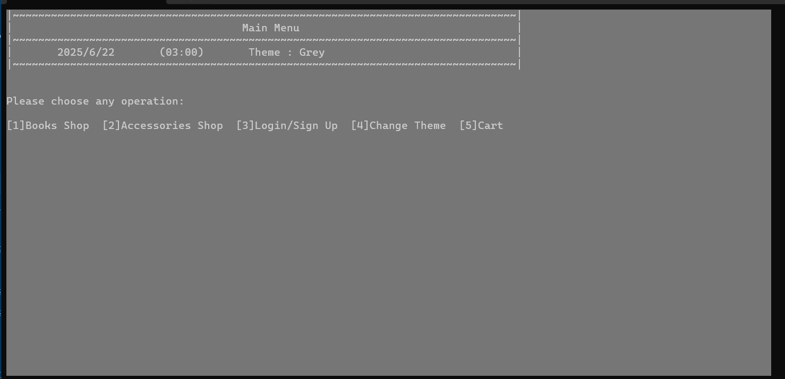

- **Login Page**
  
  

- **User Cart**
  
  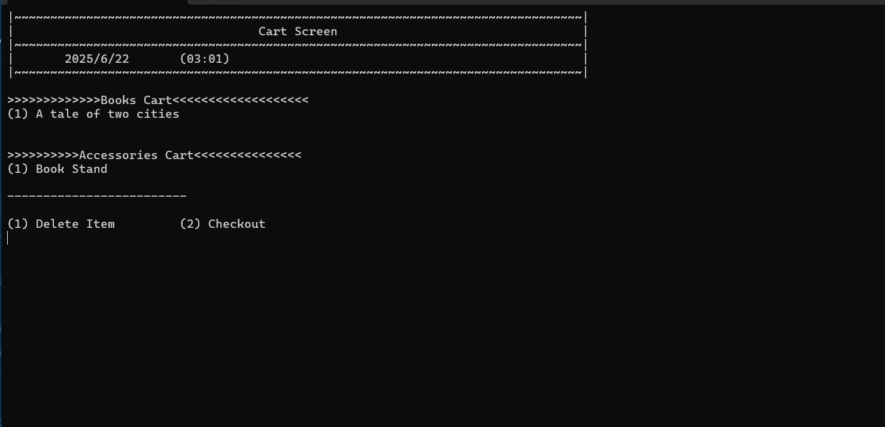

---

###  Book Management

- **Books List**
  
  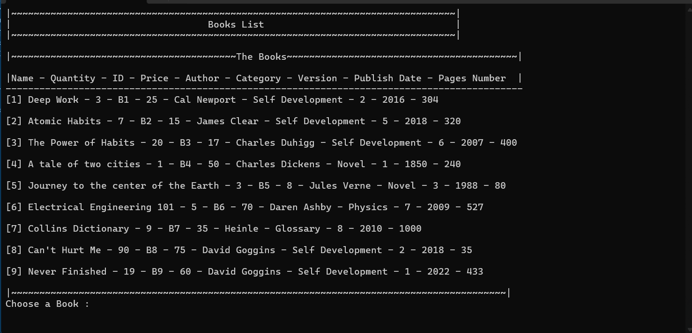

- **Search For A Book**
  
  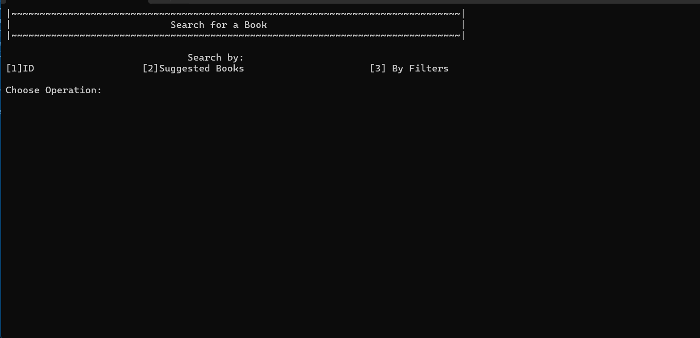

- **Search By Filters(Price)**
  
  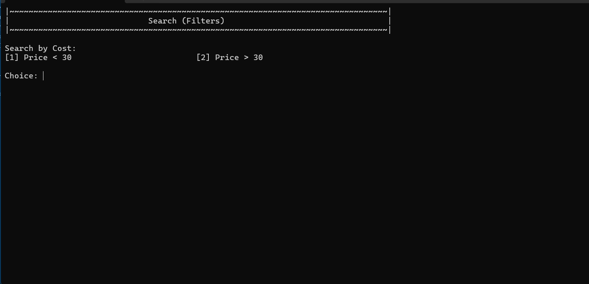

- **Book Card (As a User)**
  
  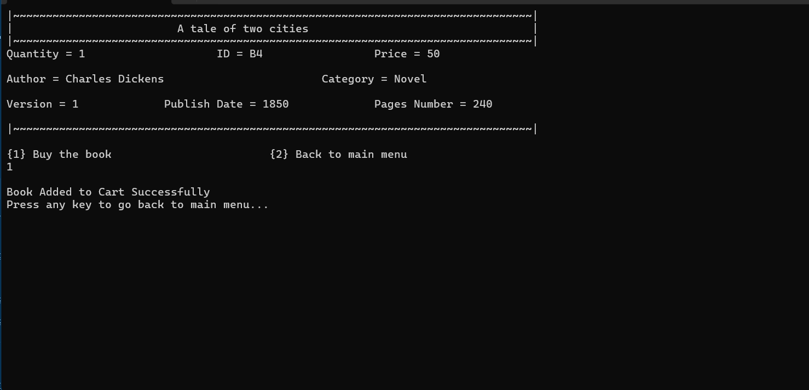

---

###  Accessories & etc

- **Accessories List**
  
  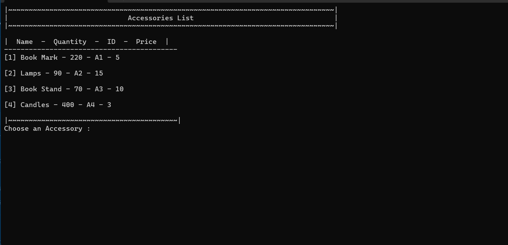

- **Accessory Card(As A User)**
  
  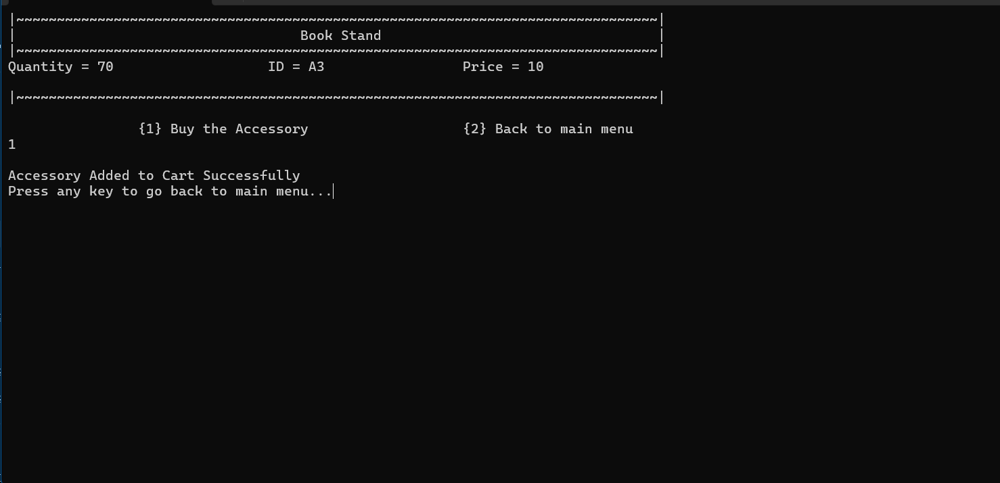

- **Admin Dashboard**
  
  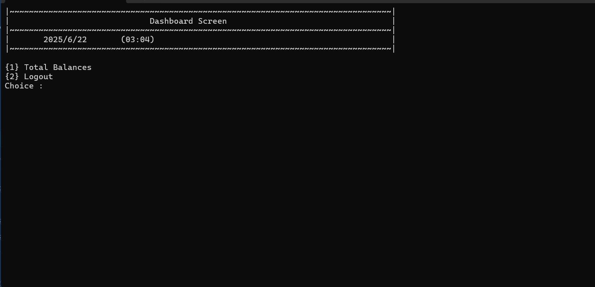

- **Buy Item (As Guest)**
  
  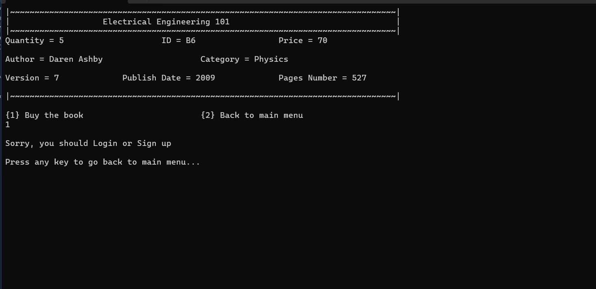

- **Checkout**
  
  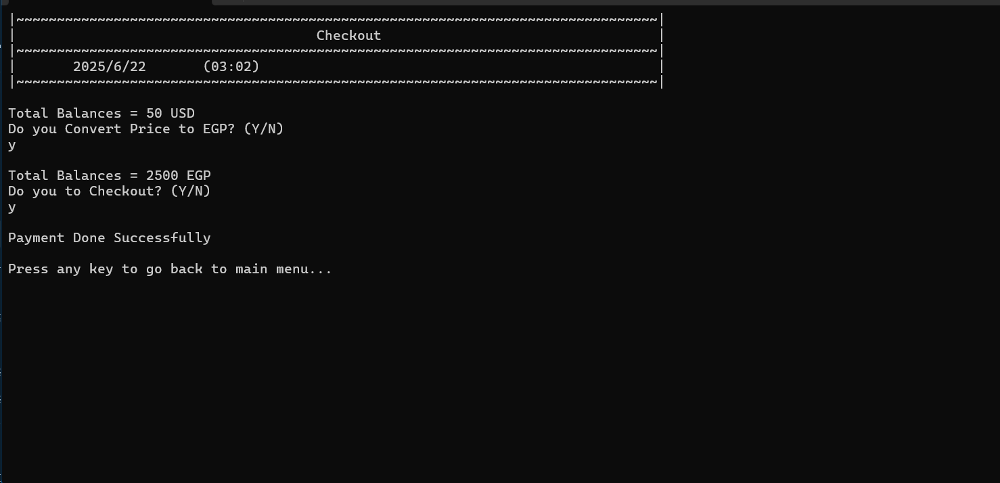

---

>  *For all screenshots, view the full folder: [`assets/`](assets/)*

---

## Author
**Mohamed Ismail**  
*LinkedIn:* linkedin.com/in/mohamed-ismail-fh

*Email:* mohamedismailfh@gmail.com
